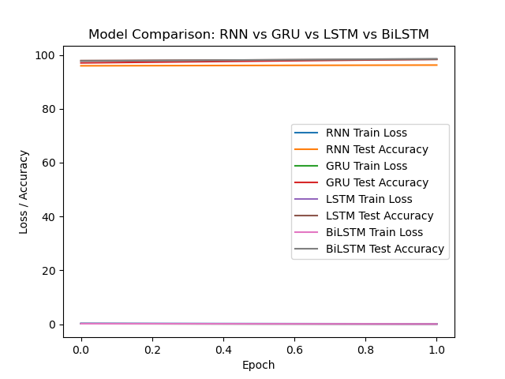

# Comparative Analysis of RNN, GRU, LSTM, and BiLSTM

This repository provides a comprehensive comparison of four popular recurrent neural network architectures: **RNN**, **GRU**, **LSTM**, and **BiLSTM**. The project uses PyTorch to implement and evaluate these architectures on the MNIST dataset, highlighting their performance through training loss and test accuracy metrics.


## Features

- Implementation of RNN, GRU, LSTM, and BiLSTM models with customizable hyperparameters.
- Training and evaluation pipelines for sequence modeling tasks.
- Visualization of model performance metrics.
- A modular and scalable codebase for experimenting with different hyperparameters and datasets.


## Installation

Clone this repository to your local machine:
```bash
git clone https://github.com/cxycode32/Comparative-Analysis-of-RNN-GRU-LSTM-BiLSTM.git
cd Comparative-Analysis-of-RNN-GRU-LSTM-BiLSTM
```

Install the required dependencies:
```bash
pip install -r requirements.txt
```


## Usage

Run the training script with default parameters:
```bash
python main.py
```


### File Structure

```
├── assets/  # Images of model comparison
├── main.py  # Main script for training and evaluation
├── README.md               # Project documentation
└── requirements.txt        # Required dependencies
```


## Visualization

### Training and Validation Accuracy

The loss and accuracy of each model.




## Contribution

Feel free to fork this repository and submit pull requests to improve the project or add new features.


## License

This project is licensed under the MIT License.
